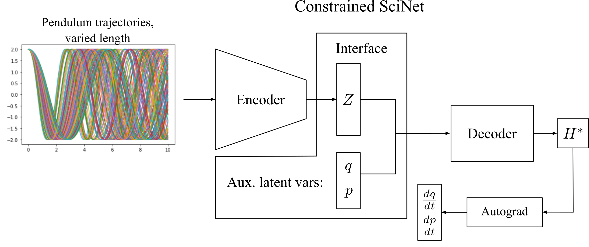
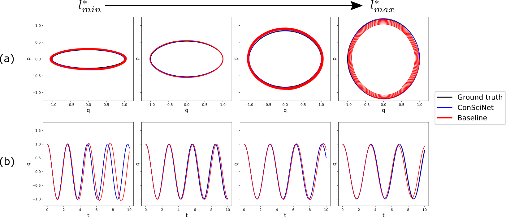

# Joint Parameter Discovery and Generative Modeling of Dynamic Systems

Gregory Barber, Mulugeta A. Haile, and Tzikang Chen | 2021

This repository contains the trained models, data and code used in the publication: ADD PUBLICATION LINK .

___
## Summary

add abstract here

## Colab links:

- Pendulum:    add link when public
- Mass-spring: add link when public

## nbviewer links:
- Pendulum: https://nbviewer.jupyter.org/github.com/gbarber94/ConSciNet/blob/main/ConSciNet_pendulum.ipynb
- Mass-spring: https://nbviewer.jupyter.org/github.com/gbarber94/ConSciNet/blob/main/ConSciNet_mass_spring.ipynb

## Dependencies
- PyTorch
- NumPy
- SciPy
- Autograd
