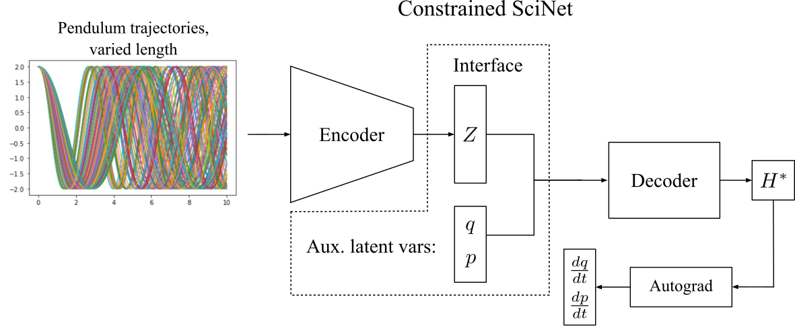

# ConSciNet

Given an unknown dynamical system, we are often interested in gaining insights into its physicalparameters.  For instance, given an observation of the motion of a harmonic oscillator with obser-vations available in the form of video frames or time-series data, we wish to know the stiffness,damping coefficients, and mass. How do we do this from observation and without the knowledge ofthe dynamics model? In this paper, we present a neural framework for estimating physical parametersin a manner consistent with the underlying physics. The neural framework uses a deep latent variablemodel that disentangles the system’s physical parameters from canonical coordinate observations.The network then returns a Hamiltonian parameterization that generalizes well with respect to thediscovered physical parameters. We apply our framework to simple dynamical problems and showthat it discovers physically meaningful parameters while respecting the governing physics
